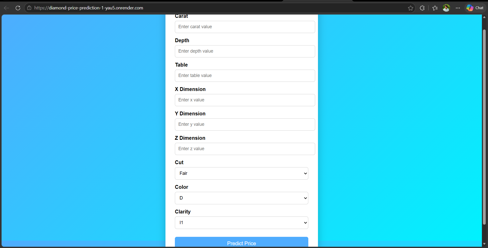
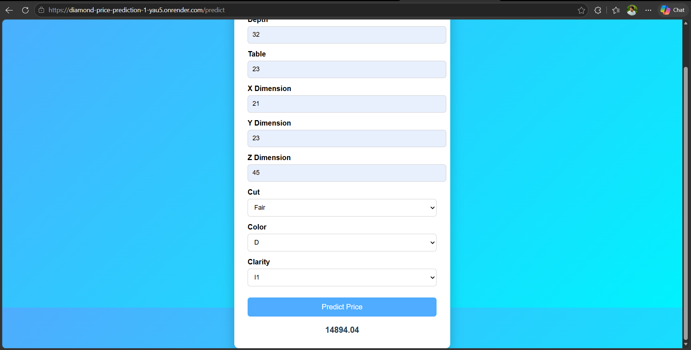

💎 Diamond Price Prediction

A Machine Learning project that predicts diamond prices based on various features such as carat, cut, color, clarity, and dimensions using regression algorithms. The project helps estimate diamond prices accurately through data analysis and predictive modeling.

📌 Project Overview

The Diamond Price Prediction system uses Machine Learning techniques to analyze diamond characteristics and predict their market price. The model is trained on historical diamond datasets and learns the relationship between diamond attributes and pricing.

This project demonstrates:

Regression Modeling
Data Preprocessing
Feature Engineering
Exploratory Data Analysis (EDA)
Machine Learning Workflow
🚀 Features
Predict diamond prices accurately
Data preprocessing and cleaning
Feature engineering
Multiple regression algorithms
Model evaluation and performance metrics
User-friendly prediction workflow
🛠️ Tech Stack
Python
Pandas
NumPy
Scikit-learn
Matplotlib
Seaborn
Jupyter Notebook
VS Code
📂 Dataset

The dataset contains diamond features such as:

Carat
Cut
Color
Clarity
Depth
Table
X, Y, Z dimensions
Price

Dataset commonly used for diamond price prediction tasks.

⚙️ Machine Learning Concepts Used
Linear Regression
Random Forest Regression
Decision Tree Regression
Data Scaling
Feature Encoding
Train-Test Split
Model Evaluation Metrics
📁 Project Structure
Diamond-Price-Prediction/
│
├── notebooks/
│   └── diamond_prediction.ipynb
│
├── data/
│   └── diamonds.csv
│
├── models/
│   └── model.pkl
│
├── app.py
├── requirements.txt
├── README.md
└── assets/
🔧 Installation

Clone the repository:

git clone https://github.com/Devender-Mathela/Diamond-Price-Prediction.git

Move to project directory:

cd Diamond-Price-Prediction

Install dependencies:

pip install -r requirements.txt
▶️ Run the Project

If using Jupyter Notebook:

jupyter notebook

If using Flask/Streamlit app:

python app.py
💡 How It Works
Load diamond dataset
Clean and preprocess data
Perform feature engineering
Train regression models
Evaluate model performance
Predict diamond prices
📊 Model Workflow
Input Diamond Features
          ↓
Data Preprocessing
          ↓
Feature Engineering
          ↓
Model Training
          ↓
Regression Prediction
          ↓
Predicted Diamond Price
📈 Results
Successfully predicted diamond prices using regression models
Achieved strong prediction accuracy
Learned relationships between diamond features and pricing
Improved understanding of regression-based ML systems

Research and similar implementations show Random Forest and regression-based models perform effectively for diamond pricing tasks.

📸 Screenshots

Add your project screenshots here.

Home Page

Prediction Output

Model Training / Graphs

📚 Learning Outcomes

Through this project, I learned:

Regression algorithms
Data preprocessing techniques
Exploratory Data Analysis
Feature engineering
Model evaluation methods
End-to-end Machine Learning workflow
🔮 Future Improvements
Deploy using Streamlit or Flask
Add real-time prediction API
Improve model accuracy
Add advanced ensemble models
Cloud deployment support
👨‍💻 Author

Deepu Mathela

GitHub: Devender-Mathela GitHub
📄 License

This project is licensed under the MIT License.

Project Repository: Diamond-Price-Prediction Repository
